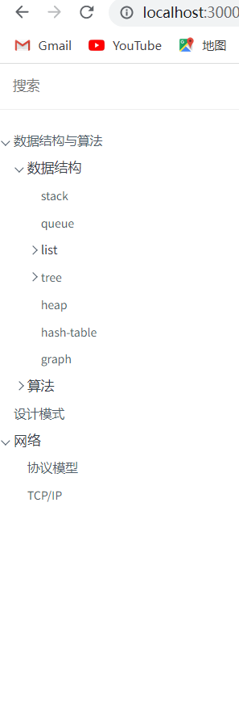

​	最近复习准备面试fork了几个八股文的笔记项目，但是知识太零碎了，就也想自己搭建一个在线博客记录整理一下。最开始首选的是gitbook,但是按步骤安装后创建项目出现了错误，谷歌之后发现是个遗留问题但是gitbook团队一直没有解决，虽然有迂回方法但是对其印象不太好。后来发现了docisfy，安装使用过程很顺利，暂时满足自己的需求，就记录下入门使用的教程。

## 安装node环境

​		首先需要安装node环境，我现在使用的是最新版的node(18.16.0),安装步骤这里我就不再赘述了，后续会考虑写个node安装的文章包括windows和mac环境（我对mac环境的安装也不太熟悉，刚好学习一下）。

## 安装docsify

​		执行以下命令使用npm安装`docsify`，官方建议全局安装`docsify-cli`脚手架。

```
npm i docsify-cli -g
```

安装成功后查看版本如下图：


## 初始化项目

​		执行`init`命令来初始化项目,`docsify-cli`会自定帮你创建文件夹并创建初始化文件

```
docsify init ./docsify-demo
```


    初始化成功后会看到如下图几个文件

- index.html：`docsify`入口文件，引入样式、插件和设置配置都是在这个文件
- README.md：主页渲染文件，如果你的`docsify`是个单页面的话，这个文件就是你编写笔记的文件
- .nojekyll：阻止GitHub Pages 忽略下划线开头的文件（部分人可能会对这个文件感到疑惑，文章后面我会简单解释一下这个文件）


## 预览项目

 通过运行 `docsify serve` 启动一个本地服务器，可以方便地实时预览效果。默认访问地址 [http://localhost:3000](http://localhost:3000/) 。 

```
docsify serve docs
```

## 基础配置项

上面说到我们的配置项和文件的引用都是在index.html完成的，下面是我的项目配置文件，涵盖了我当前使用到的功能，后续如果有使用新的功能我也会及时更新下面的代码

```html
<!DOCTYPE html>
<html lang="en">
<head>
  <meta charset="UTF-8">
  <title>Document</title>
  <meta http-equiv="X-UA-Compatible" content="IE=edge,chrome=1" />
  <meta name="description" content="Description">
  <meta name="viewport" content="width=device-width, initial-scale=1.0, minimum-scale=1.0">
  <link rel="stylesheet" href="//cdn.jsdelivr.net/npm/docsify@4/lib/themes/vue.css">
  <link rel="stylesheet" href="//cdn.jsdelivr.net/npm/docsify-sidebar-collapse/dist/sidebar.min.css" />
</head>
<body>
  <div id="app"></div>
  <script>
    window.$docsify = {
      repo: 'https://github.com/docsifyjs/docsify/',// 仓库地址，点击右上角的Github章鱼猫头像会跳转到此地址
      loadNavbar:'navbar.md',//默认加载 _navbar.md 作为顶部导航栏
      loadSidebar:true,//默认加载 _sidebar.md 作为侧边栏  使用折叠目录插件必须使用默认侧边栏
      autoHeader: true,
      coverpage: 'cover.md',  // 自定义文件名
      sidebarDisplayLevel: 1,//默认折叠的层级
      auto2top: true,//切换页面后是否自动跳转到页面顶部。
      mergeNavbar: true,// 小屏设备下合并导航栏到侧边栏
      search:{
        paths:'auto',
        placeholder:'搜索',
        noData:'nothing',
        depth:3
      },
      alias: {
      '/.*/_sidebar.md': '/_sidebar.md',
      },
    }
  </script>
  <!-- Docsify v4 -->
  <script src="//cdn.jsdelivr.net/npm/docsify@4"></script>
  <!-- emoji表情支持 -->
  <script src="//cdn.jsdelivr.net/npm/docsify/lib/plugins/emoji.min.js"></script>
  <!-- 图片放大缩小支持 -->
  <script src="//cdn.jsdelivr.net/npm/docsify/lib/plugins/zoom-image.min.js"></script>
  <!-- 搜索插件 -->
  <script src="//cdn.jsdelivr.net/npm/docsify/lib/plugins/search.min.js"></script>
  <!--在所有的代码块上添加一个简单的Click to copy按钮来允许用户从你的文档中轻易地复制代码-->
  <script src="//cdn.jsdelivr.net/npm/docsify-copy-code/dist/docsify-copy-code.min.js"></script>
  <!-- 目录支持折叠插件 -->
  <script src="//cdn.jsdelivr.net/npm/docsify-sidebar-collapse/dist/docsify-sidebar-collapse.min.js"></script>
</body>
</html>

```

## 封面设置

 封面的生成同样是从 markdown 文件渲染来的。开启渲染封面功能后在文档根目录创建 `_coverpage.md` 文件。渲染效果如本文档。 

```html
<!-- index.html -->

<script>
  window.$docsify = {
    coverpage: true// 默认使用_cover.md 作为封面文件
    coverpage: 'xxx.md'// 也可以使用自己定义名称的md文件来作为封面文件
  }
</script>
<script src="//cdn.jsdelivr.net/npm/docsify/lib/docsify.min.js"></script>
```

提供下我的封面文件，大家可以参考一下

```markdown
<!-- _coverpage.md -->

<!--  -->

# g-diary <small>1.0</small>

> 一个普通的程序员日记。

- 学习日记
- 个人随笔
- and more ...

[GitHub](https://github.com/docsifyjs/docsify/)
[Get Started](/README.md)

```

## 侧边栏配置

 为了获得侧边栏，您需要创建自己的_sidebar.md，你也可以自定义加载的文件名。默认情况下侧边栏会通过 Markdown 文件自动生成，效果如当前的文档的侧边栏。 （这里的意思是如果你不设置sidebar文件的话，docsify会依据你的markdown文件的标题来生成侧边栏，这个适用于单页面的项目。如果你想创建一个多级目录的docsify项目的话，建议设置自定义侧边栏）

```
<!-- index.html -->

<script>
  window.$docsify = {
    loadSidebar: true
    loadSidebar: 'xxx.md'// 也可以使用自己定义名称的md文件来作为侧边栏文件
  }
</script>
<script src="//cdn.jsdelivr.net/npm/docsify/lib/docsify.min.js"></script>
```

也给大家分享一个侧边栏的文件

```markdown
- [数据结构与算法](/general/algorithm/README.md)
  - 数据结构
    - [stack](/general/algorithm/data-structures/stack/README.zh-CN.md)
    - [queue](/general/algorithm/data-structures/queue/README.zh-CN.md)
    - list
      - [linked-list](/general/algorithm/data-structures/linked-list/README.zh-CN.md)
      - [doubly-linked-list](/general/algorithm/data-structures/doubly-linked-list/README.zh-CN.md)
    - [tree](/general/algorithm/data-structures/tree/README.zh-CN.md)
      - [binary search tree](/general/algorithm/data-structures/tree/binary-search-tree/README.md)
      - [red black tree](/general/algorithm/data-structures/tree/red-black-tree/README.md)
    - [heap](/general/algorithm/data-structures/heap/README.zh-CN.md)
    - [hash-table](/general/algorithm/data-structures/hash-table/README.md)
    - [graph](/general/algorithm/data-structures/graph/README.zh-CN.md)
  - 算法
    - [排序算法](/general/algorithm/algorithms/sorting.md)
- [设计模式](/general/design-pattern/README.md)
- 网络
  - [协议模型](/general/network/protocol-model.md)
  - [TCP/IP](/general/network/tcp-ip.md) 
```

页面效果如下图（折叠效果是加入插件效果，如果你和我的index.html文件相同侧边栏目录也会有折叠箭头的效果）



## 导航设置

  加载自定义导航栏， 设置为 `true` 后会加载 `_navbar.md` 文件，也可以自定义加载的文件名。 

```javascript
window.$docsify = {
  // 加载 _navbar.md
  loadNavbar: true,

  // 加载 nav.md
  loadNavbar: 'nav.md',
};
```

